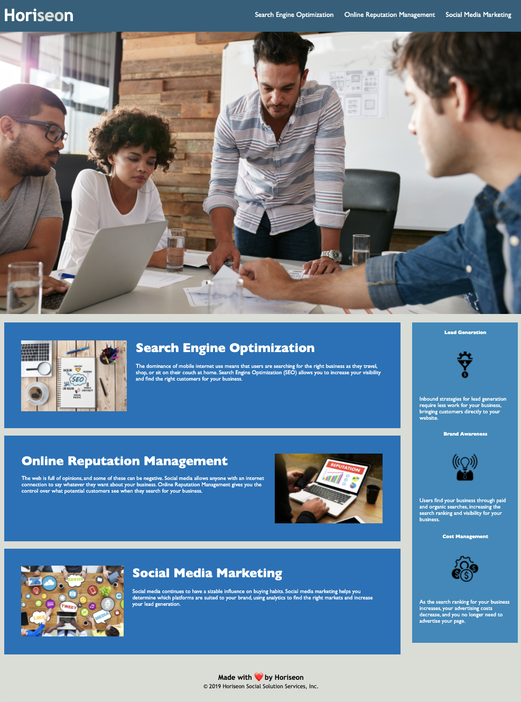

# BC-Refactoring

## Intro:
The criteria for this job ticket example was to refactor an existing website to solve it's SEO and accessibility issues from within the html and css.  There are numerous improvements with the changes indicated by comments within the html and css files and in the summary below. There are also general upgrades to the code in terms of a cleaner, more logical hierarchy of html elements and an included css reset file to improve browser compatibility.

---

## Site Picture:

---

## Technologies Used:
- HTML
- CSS

---

## Summary:
- Accessibility Enhancements: Clear titling and liberal use of alt tags in image and semantic elements have been added to satisfy the web's growing emphasis on accessibiity.
- Semantics Enhancements: The prior code version relied almost exclusively on div tags when it is more beneficial in the case of this website to incorporate semantic tags to improve SEO as well as accessibility.
- Hierarchy: Within the html, the hierarchy has been cleaned up to more coherently reflect the relationships between the site's elements and allow better indication of the enhancement comments.
- CSS consolidations: Redundant css classes were consolidated into multiple argument classes
- CSS reset: Not part of the criteria but as part of best practices, a css reset sheet was included and linked for better browser competibility

## Code Snippets:
`<!-- Semantics Enhancement: div to section -->
        <!-- Code Resolved: CSS id to class -->
        <!-- Accessibility Enhancement: alt="Online Reputation Management Pitch"> -->
        <section class="online-reputation-management" alt="Online Reputation Management Pitch">
            <!-- Accessibility Enhancement: alt="Online Reputation Managment" -->
            
                <h2>Online Reputation Management</h2>
                    

                        The web is full of opinions, and some of these can be negative. Social media allows anyone with an internet connection to say whatever they want about your business. Online Reputation Management gives you the control over what potential customers see when they search for your business.
                    

        </section>
`

---

## README Author Links:
Robert Schramm
- [GitHub](https://github.com/rbrtpublic1)
- [LinkedIn](https://www.linkedin.com/in/robertwschramm/)

## Website Owner:
&copy; 2019 Horiseon Social Solution Services, Inc.
